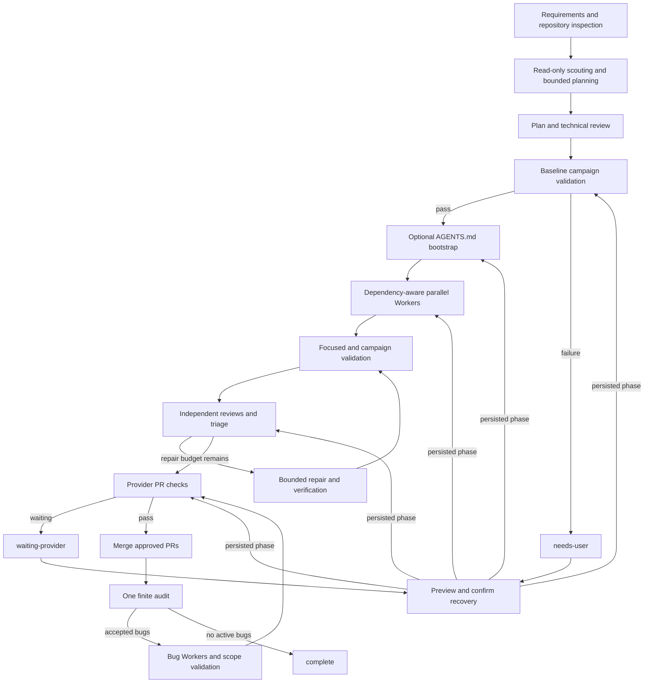

# Relay

Relay is a bounded, resumable coordinator that turns requirements into isolated GitHub or Azure DevOps Services pull requests. It plans work, dispatches constrained coding agents, validates their commits, reviews candidates, merges approved PRs, and runs one finite post-build audit.

```text
requirements
    |
    v
plan.py -> plan review -> technical audit -> optional repair verification -> PLAN.md + missing AGENTS.md
    |
    v
run.py -> planned-base campaign validation -> AGENTS.md bootstrap PR (when needed)
    |
    v
Workers -> focused + campaign validation -> review/repair -> provider PRs -> merge
    |
    v
finite audit -> accepted bug fixes -> complete

status.py observes the active campaign without changing it.
```

Relay is four directly executable Python scripts. It uses only Python 3.11's standard library and shells out to `git`, `codex`, and either `gh` or `az`.

## Prerequisites

- Python 3.11 or newer.
- Git with an author name and email configured.
- For GitHub, the GitHub CLI authenticated with `gh auth login`.
- For Azure DevOps Services, Azure CLI 2.30+ with the `azure-devops` extension and authentication configured through its supported Microsoft Entra or PAT flow. Azure DevOps Server is not supported.
- Codex available as `codex`.
- A target repository whose integration branch and PR base are `main`.
- A supported GitHub or Azure Repos `origin` before running a campaign. `repo.py` can create it.

Set `RELAY_GIT`, `RELAY_GH`, `RELAY_AZ`, or `RELAY_CODEX` only when Relay should invoke those tools through different commands. Relay never reads or stores provider credentials.

For Azure, install the official extension with `az extension add --name azure-devops`, then authenticate with `az login` or pipe a PAT to `az devops login --organization https://dev.azure.com/ORGANIZATION`. The Azure CLI owns that credential flow; do not pass credentials to Relay.

## Quick start

Run these commands from the Relay checkout. On Windows, `py -3.11` is an equivalent to `python`.

1. Create and publish a new repository:

```powershell
python repo.py `
  --path C:\Code\Projects\Example `
  --github OWNER/Example `
  --private
```

Or create it in an existing Azure DevOps project (repository visibility is inherited from the project):

```powershell
python repo.py `
  --path C:\Code\Projects\Example `
  --azure-devops ORGANIZATION PROJECT Example
```

2. For an existing repository, skip `repo.py`. Write the requirements in a Markdown file, then generate and review the bounded plan:

```powershell
python plan.py `
  --repo C:\Code\Projects\Example `
  --requirements C:\path\to\requirements.md `
  --workers 3 `
  --task-attempts 3 `
  --fix-loops 2
```

Review `PLAN.md`, especially its campaign-validation commands, task dependencies, allowed paths, acceptance criteria, and limits. Validate it without creating campaign state:

```powershell
python run.py --repo C:\Code\Projects\Example --dry-run
```

3. Start the campaign with the same limits used by `plan.py`:

```powershell
python run.py `
  --repo C:\Code\Projects\Example `
  --workers 3 `
  --task-attempts 3 `
  --fix-loops 2
```

`--task-attempts` and `--fix-loops` must match between planning and the first campaign run. Observe progress at any time:

```powershell
python status.py --repo C:\Code\Projects\Example
```

Use the same `python run.py --repo ...` command with no stdin or new `--plan` to resume an interrupted or provider-waiting campaign; Relay reloads the persisted limits and provider identity.

4. If Relay stops in `needs-user`, preview recovery before changing state:

```powershell
python run.py --repo C:\Code\Projects\Example --recover
```

Correct the external problem, then copy the printed command exactly. State-changing recovery requires `--confirm`:

```powershell
python run.py --repo C:\Code\Projects\Example --recover --confirm
python run.py --repo C:\Code\Projects\Example --recover --grant-attempt TASK-0001 --confirm
python run.py --repo C:\Code\Projects\Example --recover --defer-blocker BUG-0001 --confirm
```

The grant and deferral forms are used only when the preview identifies those actions as valid. Confirmation journals and applies recovery but does not launch Workers; run the printed `NEXT` command afterward.

5. After completion, review `BACKLOG.md`, preview cleanup, and confirm it:

```powershell
python run.py --repo C:\Code\Projects\Example --cleanup
python run.py --repo C:\Code\Projects\Example --cleanup --confirm
```

6. Start the next finite campaign from the published backlog:

```powershell
python plan.py `
  --repo C:\Code\Projects\Example `
  --requirements C:\Code\Projects\Example\BACKLOG.md
python run.py --repo C:\Code\Projects\Example
```

Run the required deterministic regression suite:

```powershell
python -m unittest -v test_workflow.py
```

For an existing repository, `plan.py` plans against its selected `HEAD`; Relay refuses to start if that planned base no longer matches `HEAD`.

## Project Architecture

Relay stays as directly executable scripts plus one small console helper:

| File | Responsibility |
| --- | --- |
| `repo.py` | Create a local `main` repository, add generic target instructions, and optionally publish it to GitHub or Azure DevOps Services. |
| `plan.py` | Inspect the repository, run read-only scouting, produce a bounded task plan, run contract and risk reviews, and validate the plan before writing `PLAN.md`. |
| `run.py` | Coordinate campaign state transitions, dependency-aware Workers, worktree validation, reviews, repairs, recovery, provider PR operations, audit, backlog publication, and cleanup. |
| `status.py` | Read-only inspection of campaign phases, operations, budgets, provider waits, blockers, bugs, worktrees, and PRs. |
| `relay_console.py` | Emit deterministic console events and progress output without mixing raw agent or provider logs into coordinator output. |
| `test_workflow.py` | Run the deterministic regression suite for transitions, retries, recovery, PR handling, concurrency, and cleanup. |

`run.py` owns active ledgers and runtime state. `.relay/state.json` is the resume authority; `tasks.md` tracks task execution; `bugs.md` tracks review and audit findings; `BACKLOG.md` carries deferred work between campaigns; and `.relay/logs/` stores raw agent, provider, and validation logs. Isolated worktrees and branches keep candidate changes separate from the target's integration branch.

## Workflow

### 1. Repository creation

`repo.py` refuses to overwrite a nonempty path. It initializes `main`, creates `README.md` and Relay's generic target `AGENTS.md`, and commits both. `--github OWNER/NAME` requires exactly one of `--private` or `--public`. `--azure-devops ORGANIZATION PROJECT REPOSITORY` uses `az repos create`, adds its returned HTTPS clone URL as `origin`, and pushes the initial commit; the project must already exist. Publication failures preserve the local repository. The two provider options are mutually exclusive, and visibility flags are GitHub-only.

### 2. Planning

`plan.py` reads the requirements, tracked tree, selected base SHA, and target instructions. For a nontrivial repository it runs fixed, read-only scout scopes concurrently, then a read-only Planning PM produces a bounded task graph. A contract reviewer checks requirement and task consistency, then a technical risk reviewer checks feasibility, exact validation commands, target-platform behavior, and required paths against the repository. Relay validates every structured result before it writes anything.

If either review finds an execution-blocking defect, the Planning PM gets one repair pass and a verification reviewer checks only those findings. An unresolved verification fails planning without creating `PLAN.md`; there is no recursive review loop. A clean draft skips repair and verification.

Planner attempts report `START`, `WAIT`, `DONE`, `RETRY`, and `FAILED` lifecycle events on stderr. Agent stdout and stderr remain captured separately.

On success, planning exclusively creates `PLAN.md`, then exclusively creates `AGENTS.md` if it is still missing. Existing files or other filesystem entries are preserved. When `AGENTS.md` was initially missing, scouts and the Planning PM receive the same generic rules in memory.

`PLAN.md` records explicit campaign-validation commands plus each task's dependencies, allowed paths, acceptance criteria, focused validation commands, attempt limit, and shared fix-loop limit. Campaign commands must pass on the untouched planned base and every candidate; task-specific regression commands are never promoted automatically. Relay refuses to start a new campaign if the planned base no longer matches `HEAD`. Successful planning keeps stdout to the generated path and emits deterministic `SUMMARY` and executable `NEXT` lines on stderr.

### 3. Target instructions bootstrap

Relay never copies this repository's development `AGENTS.md` into a target. The generic target template lives in `repo.py` and tells agents to honor their assigned role and paths, leave coordinator files alone, avoid provider operations and subagents, validate their work, and report evidence.

- Existing tracked or untracked custom `AGENTS.md` files are honored and never automatically committed.
- New repositories already contain the generated file in their initial commit.
- For an existing repository where Relay generated the file after the planned base, `run.py` publishes an isolated PR containing only the exact `AGENTS.md` before launching Workers.
- The bootstrap uses normal provider deadlines, retries, checks, required approvals, SHA-drift protection, and the configured merge method, but no Codex reviewers.
- Its commit, push, PR, checks, merge, and local reconciliation are persisted for safe resume.
- If marked generated content changes unexpectedly, Relay preserves it and stops in `needs-user`.

### 4. Build, review, and merge

`run.py` copies the validated plan into the active `tasks.md` ledger, creates `bugs.md` and `.relay/state.json`, and excludes coordinator-owned runtime files from Git.

Before provider authentication, bootstrap, or Worker launch, Relay creates a detached worktree at the exact planned base and runs the campaign-validation commands there. A failure stops as `BASELINE` without consuming a Worker attempt; a matching successful result is cached for resume.

Ready tasks run concurrently only when dependencies are satisfied and allowed paths do not overlap. Each task gets an isolated branch and Git worktree. The Worker is the only write-capable role and must commit a candidate locally. Before publication, Relay verifies ancestry, the reported SHA, changed paths, then runs the task's focused commands once followed by the campaign commands once. The same candidate and stable validation failure repeated twice trips a circuit breaker instead of spending the remaining Worker attempts.

A terminal campaign preserves its last clean validation candidate. A plain resume may replay that candidate's validation once without consuming a Worker or repair attempt, then continue review and publication if it passes. A failed replay remains terminal; Relay prints the complete `--recover --grant-attempt` command instead of silently launching new implementation work. Validation blockers are grouped by category, command hash, and outcome, while their exact command, affected assignments, required external change, and logs remain visible.

Validation commands run explicitly through `pwsh -NoLogo -NoProfile -NonInteractive -Command` on Windows and `/bin/sh -c` on POSIX; set `RELAY_PWSH` to override the PowerShell executable. Relay checks that shell before launching Workers. Each command's shell, exit code, stdout, and stderr is captured in `.relay/logs/<assignment>-validation-<number>.log`; console and state errors contain only the command number, result, and log path. A failed initial validation stays within the task-attempt budget, while repair validation stays within the shared fix-loop and review-call budgets.

Relay then pushes the branch, opens or recovers one PR, and runs two independent read-only reviews followed by one triage decision. Accepted blockers enter the same bounded Worker repair loop and receive a focused verification review. Initial blockers, merge conflicts, integration failures, and provider-check repairs share one persisted fix-loop budget.

Approved candidates must retain the reviewed SHA and pass the selected provider's required checks and approvals before Relay merges them. For Azure, blocking branch-policy evaluations are authoritative: approved and not-applicable pass, queued and running wait within the persisted deadline, and rejected or broken fail. Conflicts enter the shared repair budget, and Relay never bypasses policies. Azure supports Relay's `squash` and standard no-fast-forward `merge` completion modes; `rebase` is rejected during preflight. Completed worktrees and local branches are removed.

`run.py` detects canonical GitHub and Azure HTTPS/SSH origins, including `visualstudio.com` Azure URLs, then persists the provider identity. Azure PR descriptions are passed as a single line for Windows `az.cmd` compatibility; GitHub continues to receive the body file. When `--repo` names a subdirectory of a Git repository, Relay preserves that prefix in bootstrap and Worker worktrees and rejects changes outside it. Resume uses the persisted provider identity and normalized PR number, URL, source SHA, and state. Use the same `run.py --repo ...` command after provider action or interruption. Push, PR creation, policy polling, merge, reconciliation, and the no-AI-review `AGENTS.md` bootstrap all resume without intentionally duplicating completed operations. Campaign state is versioned strictly; unsupported state must be replaced with a newly reviewed plan rather than recovered heuristically.

Terminal `needs-user` decisions require explicit recovery. `--recover` previews every action without changing state; add `--confirm` to journal and apply the actions, then run the printed resume command. Confirmation exits without launching Workers. Exhausted PR discovery, creation, or refresh can resume without a Worker after provider access is restored: recovery verifies the clean candidate, worktree, branch, and remote SHA, then resets only the failed provider-operation counter. `--defer-blocker BUG-NNNN` backlogs work owned by another task, and `--grant-attempt TASK-NNNN` grants one separately-accounted Worker attempt. A candidate deletion outside static scope can be adopted only when the target worktree contains the same user-owned deletion. Recovery refuses active campaigns and drifted worktrees, paths, SHAs, or provider state.

Schema-v2 campaigns that predate campaign validation are readable but never executable. A plain run prints the exact migration-preview command. Recovery groups shared validation failures, runs each shared command once in a detached worktree at the historical base, and offers `archive-and-handoff` only for a confirmed baseline defect. Confirmation creates immutable `relay/archive/<campaign>/<task>` refs, validates a byte-stable `.relay-archive/<campaign>/` snapshot and managed `HANDOFF.md`, then removes the old worktrees and active ledgers. The printed `plan.py --requirements .../HANDOFF.md` command creates a modern plan. Relay validates the handoff marker, hashes, ancestry, and refs; injects preserved seed metadata itself; promotes the shared full-build command to campaign validation; and keeps the remaining focused task commands unchanged. Seeded Workers must reapply the archived diff onto the new planned base and produce a newly validated descendant.

### 5. Finite audit

After all planned tasks integrate, Relay updates local `main` and plans one finite audit campaign. Each scope requires explicit executable validation commands. Read-only Audit Workers inspect explicit scopes concurrently, and triage classifies their human-readable reproduction evidence once. Accepted P0/P1 findings become bounded bug-mode Worker assignments validated by their originating scope commands; P2 findings may enter the backlog. Fixes do not trigger recursive audit planning.

The campaign becomes `complete` when no active audit bugs remain. Before completion, Relay atomically publishes every deferred bug to a repository-visible `BACKLOG.md`; a later campaign replaces or removes only a Relay-owned backlog for the same repository. A blocker needing judgment becomes `needs-user`; incomplete provider checks become `waiting-provider`. Every terminal wave emits deterministic task, baseline, bug, and next-step summaries from validated ledgers and state.

Use a completed campaign's backlog directly as the next requirements input:

```powershell
python plan.py `
  --repo C:\path\to\target `
  --requirements C:\path\to\target\BACKLOG.md
```

## Workflow Architecture

Each campaign follows one finite lifecycle:

1. Read requirements and inspect the repository.
2. Scout read-only scopes and produce a bounded plan.
3. Review the plan for contract and technical risk, then validate it.
4. Run mandatory campaign validation on the planned base.
5. Bootstrap a generic `AGENTS.md` through an isolated PR when needed.
6. Execute dependency-aware Worker assignments in isolated worktrees.
7. Run focused validation and mandatory campaign validation on candidates.
8. Run independent reviews and triage findings.
9. Apply bounded repairs and verification reviews.
10. Run provider PR checks and merge approved candidates.
11. Run one finite audit with explicit scopes and commands.
12. Fix accepted bugs within the same bounded workflow and publish deferred work to `BACKLOG.md`.
13. Reach `complete` and offer confirmed cleanup.



Recovery resumes the persisted phase that is safe for the recorded worktree, SHA, provider operation, or baseline result. Recovery does not restart planning, create recursive audits, or silently grant attempts.

## Agents

Agents receive explicit prompts and validated structured-output schemas. Raw stdout and stderr are captured separately from coordinator output. Attempts, review calls, repair loops, provider operations, and deadlines are persisted and mechanically bounded. Agents do not perform provider operations, create recursive work, or modify coordinator-owned state unless the assigned role explicitly permits it.

| Agent type | Responsibility | Write access |
| --- | --- | --- |
| Scout | Read-only repository inspection for planning | None |
| Planning PM | Produce bounded tasks and campaign validation commands | None |
| Contract reviewer | Check requirements, acceptance criteria, and candidate regressions | None |
| Risk reviewer | Check correctness, regressions, security, data loss, and tests | None |
| Triage PM | Classify findings as blocker, backlog, discard, or needs-user | None |
| Worker | Implement one assigned task, bug, or repair and commit a candidate | Assigned worktree only |
| Verification reviewer | Verify only the accepted repair delta | None |
| Audit planner | Define one finite set of audit scopes and commands | None |
| Audit worker | Inspect one assigned audit scope and report evidence | None |

## Validation and failure behavior

Campaign-validation commands are mandatory. Relay runs them on the planned base and on every candidate; passing focused validation never bypasses campaign validation. Validation failures preserve the exact command and log path. Where supported, Relay automatically replays a clean terminal candidate once. A `needs-user` recovery always requires an explicit preview followed by a confirmed action. Copy printed `NEXT` commands exactly, including `--confirm` when it is present.

| Situation | Behavior and operator action |
| --- | --- |
| Baseline validation failure | Relay stops before Worker attempts. Fix the baseline condition, inspect the recorded command and `.relay/logs/` path, then use the printed replay or `--recover` preview. |
| Candidate validation failure | The candidate remains recorded with its exact command and log. Fix or review the condition; a terminal candidate may be replayed once, otherwise use an explicit recovery or grant when offered. |
| Provider wait | The campaign is `waiting-provider`; use `status.py`, restore or approve the external check, then resume with `python run.py --repo ...`. |
| Provider publication failure | Restore provider access, run `python run.py --repo ... --recover` to preview safe publication recovery, confirm it, then run the printed resume command. |
| Worktree setup failure | Relay preserves the bounded state and stops in `needs-user`. Inspect the worktree and path/SHA evidence, then use only the recovery action shown by the preview. |
| Review or repair exhaustion | The shared review/fix-loop budget is preserved. Defer an eligible blocker with `--defer-blocker BUG-NNNN`, grant a separately-accounted task attempt with `--grant-attempt TASK-NNNN`, or resolve the blocker and follow the preview. |
| Legacy campaign migration | Run `python run.py --repo ... --recover` to preview migration. Confirm only the offered archive-and-handoff action; then create the modern plan from the printed `HANDOFF.md` requirements command. |
| Cleanup refusal | Cleanup requires a complete inactive campaign, no worktrees, and no open Relay PRs. Resolve those conditions, preview again, then use `--cleanup --confirm`. |

## Campaign files

| Path | Owner | Lifetime |
| --- | --- | --- |
| `AGENTS.md` | Target | Preserved permanently; generated only when missing |
| Relay task plan files | Planner | Removed by confirmed cleanup |
| `tasks.md` | Coordinator | Active task ledger; removed only by confirmed cleanup |
| `bugs.md` | Coordinator | Audit/review evidence ledger; removed only by confirmed cleanup |
| `BACKLOG.md` | Coordinator handoff | Latest verified deferred-work snapshot; preserved by cleanup |
| `.relay/state.json` | Coordinator | Resume authority, counters, phases, PRs, worktrees, and deadlines |
| `.relay/logs/` | Coordinator | Raw agent and provider logs, separate from console output |
| `.relay-archive/<campaign>/` | Coordinator handoff | Immutable legacy snapshot, candidate metadata, logs, and managed `HANDOFF.md`; preserved by cleanup |

Only `run.py` modifies active ledgers and runtime state. Counters are persisted before processes or provider operations start, so a crash never grants a free retry.

## Observe, validate, and clean up

Show campaign state, including active roles, review budgets, provider deadlines, PRs, worktrees, bugs, and any `AGENTS.md` bootstrap:

```powershell
python status.py --repo C:\Code\Projects\Example
```

Validate a plan without creating campaign state:

```powershell
python run.py --repo C:\Code\Projects\Example --dry-run
```

Preview permanent campaign cleanup, then confirm it:

```powershell
python run.py --repo C:\Code\Projects\Example --cleanup
python run.py --repo C:\Code\Projects\Example --cleanup --confirm
```

Cleanup is allowed only for a complete, inactive campaign with no worktrees or open Relay PRs. It removes `tasks.md`, `bugs.md`, Relay-format plan files in the repository root, and `.relay`; it preserves `.relay-archive/`, `BACKLOG.md`, human-authored plans, `AGENTS.md`, source, and Git history.

Run Relay's deterministic test gate with:

```powershell
python -m unittest -v test_workflow.py
```

Exit codes are `0` for completion, `1` for an operational or validation failure, `2` when user or provider action is required, and `130` when interrupted. A stopped campaign emits one `STOPPED` event with the assignment count followed by one sorted `BLOCKED` event per unresolved assignment or bootstrap operation. Targeted recoveries emit `RECOVER`. Raw provider and validation output remain in `.relay/logs/`.

Run any script with `--help` for all limits, deadlines, merge methods, and path options. See `PLAN.md` for the full behavioral specification.
