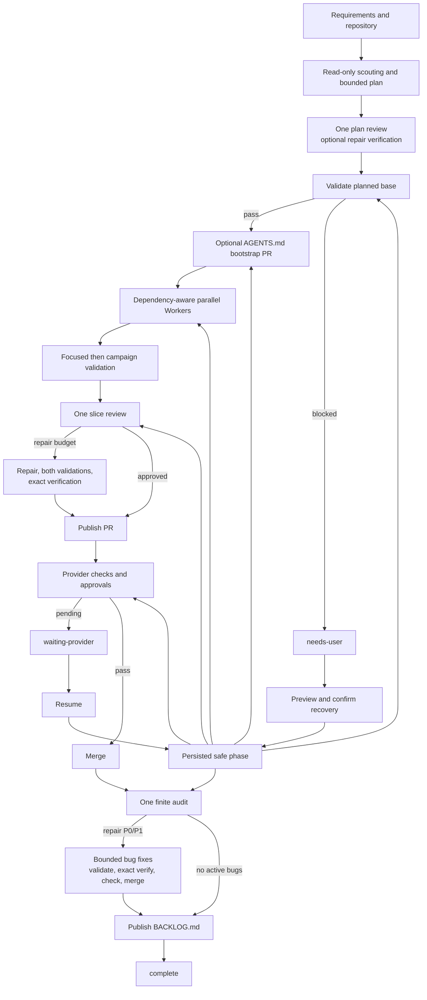

# Relay

<p align="center">
  
</p>

Relay is a bounded, resumable coordinator that turns requirements into isolated GitHub or Azure DevOps Services pull requests. It plans work, dispatches constrained coding agents, validates their commits, reviews candidates, merges approved PRs, and runs one finite post-build audit.

Relay is four directly executable Python scripts. It uses only the Python 3.11 standard library and shells out to `git`, `codex`, and either `gh` or `az`.

## Prerequisites and setup

- Python 3.11 or newer. On Windows, `py -3.11` is equivalent to `python` in the examples below.
- Git with an author name and email configured.
- Codex available as `codex`.
- A target repository whose integration branch and PR base are `main`.
- A supported GitHub or Azure Repos `origin` before a campaign starts.
- For GitHub, the GitHub CLI authenticated with `gh auth login`.
- For Azure DevOps Services, Azure CLI 2.30+ with the `azure-devops` extension. Azure DevOps Server is not supported.

Set `RELAY_GIT`, `RELAY_GH`, `RELAY_AZ`, `RELAY_CODEX`, or `RELAY_PWSH` only to substitute the corresponding executable. Relay never reads or stores provider credentials. For Azure, run `az extension add --name azure-devops`, then use `az login` or pipe a PAT to `az devops login --organization https://dev.azure.com/ORGANIZATION`; credential handling remains with Azure CLI.

For a new repository, `repo.py` creates local `main`, a README, and generic target `AGENTS.md`, commits them, and can publish them. It refuses a nonempty destination, and a publication failure leaves the local repository intact.

```powershell
python repo.py `
  --path C:\Code\Projects\Example `
  --github OWNER/Example `
  --private
```

GitHub requires exactly one of `--private` or `--public`. Alternatively, create a repository in an existing Azure DevOps project; visibility is inherited from that project.

```powershell
python repo.py `
  --path C:\Code\Projects\Example `
  --azure-devops ORGANIZATION PROJECT Example
```

The provider options are mutually exclusive, and visibility flags are GitHub-only. For an existing repository, skip `repo.py`.

## Quick start

Run commands from the Relay checkout.

### 1. Plan and review

Write the requirements in Markdown, then generate a bounded plan:

```powershell
python plan.py `
  --repo C:\Code\Projects\Example `
  --requirements C:\path\to\requirements.md `
  --workers 3 `
  --task-attempts 3 `
  --fix-loops 2
```

Review `PLAN.md`, especially its campaign-validation commands, task dependencies, allowed paths, acceptance criteria, and limits. Then validate its format without creating campaign state:

```powershell
python run.py --repo C:\Code\Projects\Example --dry-run
```

The plan records its selected `HEAD`; Relay refuses to start if that planned base no longer matches `HEAD`. The first run must use the same `--task-attempts` and `--fix-loops` values used during planning.

### 2. Run, observe, and resume

```powershell
python run.py `
  --repo C:\Code\Projects\Example `
  --workers 3 `
  --task-attempts 3 `
  --fix-loops 2
```

Observe the campaign without changing it:

```powershell
python status.py --repo C:\Code\Projects\Example
```

After an interruption or provider wait, use the same `python run.py --repo ...` command with no stdin and no new `--plan`. Relay reloads the persisted limits and provider identity.

### 3. Recover, clean up, and continue from the backlog

If the campaign stops in `needs-user`, preview recovery first:

```powershell
python run.py --repo C:\Code\Projects\Example --recover
```

Correct the external problem and copy the printed command exactly. State changes require `--confirm`; grants and deferrals are valid only when the preview offers them.

```powershell
python run.py --repo C:\Code\Projects\Example --recover --confirm
python run.py --repo C:\Code\Projects\Example --recover --grant-attempt TASK-0001 --confirm
python run.py --repo C:\Code\Projects\Example --recover --defer-blocker BUG-0001 --confirm
```

Confirmation journals and applies recovery but does not launch Workers. Run the printed `NEXT` command afterward.

After completion, review `BACKLOG.md`, preview cleanup, and confirm it:

```powershell
python run.py --repo C:\Code\Projects\Example --cleanup
python run.py --repo C:\Code\Projects\Example --cleanup --confirm
```

Start the next finite campaign from the published backlog:

```powershell
python plan.py `
  --repo C:\Code\Projects\Example `
  --requirements C:\Code\Projects\Example\BACKLOG.md
python run.py --repo C:\Code\Projects\Example
```

When changing Relay itself, run its deterministic test gate:

```powershell
python -m unittest -v test_workflow.py
```

## How Relay works



### Planning

`plan.py` reads the requirements, tracked tree, base SHA, and target instructions. For nontrivial repositories it runs fixed read-only scout scopes concurrently, then a read-only Planning PM creates the fewest independently usable vertical slices, normally three to five. A slice owns the production entrypoint, direct collaborators, contracts, and tests needed by its acceptance criteria; dependencies describe runtime prerequisites rather than implementation history. Layer-only plans are rejected. One plan reviewer checks coverage, feasibility, regressions, security, exact commands, platforms, and paths by tracing each criterion through the real production composition. Tests may fake external processes, networks, clocks, and providers, but not the internal component being integrated. Relay validates every structured result before changing state. Blocking findings get one planning repair and an exact verification; no second full review runs. Unresolved findings fail without writing `PLAN.md`, and a clean draft skips both repair calls. The planning budget is scouts plus four calls plus the format-retry allowance.

Successful planning creates `PLAN.md`, then `AGENTS.md` only if it is still missing; all other entries are preserved. `PLAN.md` fixes each task's dependencies, allowed paths, acceptance criteria, focused commands, attempt limit, shared fix-loop limit, and mandatory campaign commands. Relay-owned backlogs are parsed structurally and require exactly one task per `<origin-campaign>/<BUG-NNNN>` source reference, a declared test path, and a runnable regression command. Ordinary prose requirements and existing schema-v2 plans remain compatible. Planner `START`, `WAIT`, `DONE`, `RETRY`, and `FAILED` events go to stderr, raw agent output remains separate, stdout contains the generated path, and stderr ends with deterministic `SUMMARY` and executable `NEXT` lines.

### Baseline and bootstrap

Before provider authentication or Worker launch, `run.py` validates the campaign commands in a detached worktree at the exact planned base. Failure stops at `BASELINE` without consuming a Worker attempt; a matching success is cached for resume.

Relay honors existing tracked or untracked `AGENTS.md`. Its generic template limits agents to their assigned role and paths, reserves coordinator files and provider operations, forbids subagents, and requires validation evidence; it never copies Relay's own development instructions. When planning generated the file for an existing repository after the selected base, `run.py` first publishes an isolated PR containing only that exact file. This bootstrap has normal provider deadlines, retries, approvals, checks, SHA-drift protection, merge mode, and persisted resume points, but no Codex review. Unexpected changes to marked generated content are preserved and stop in `needs-user`.

### Build and review

`run.py` initializes the active ledgers and state and excludes coordinator runtime files from Git. Ready tasks run concurrently only after dependencies complete and only when their literal or glob scopes cannot overlap. Literal files match only themselves, literal directories include descendants, `*`, `?`, and character classes stay within one segment, and `**` spans complete segments, including zero segments. The same normalized policy validates candidates, repairs, recovery, audits, deleted files, and backlog tests. Each Worker is the sole write-capable role in its isolated branch and worktree. It traces the real entrypoint and direct callers/callees, builds the complete slice, exercises production composition, runs focused tests, and returns one clean commit. Relay checks ancestry, reported SHA, and changed paths; backlog candidates must change a declared test path. It then runs focused validation, including the mandatory regression command, followed by campaign validation. After ordinary attempts are exhausted, or the same stable failure repeats twice, Relay automatically repairs a clean candidate within the remaining shared fix-loop budget. A timed-out command first replays once on the unchanged candidate.

One read-only slice reviewer sees the fully validated candidate and complete ownership graph. It dispositions each finding as `repair`, `backlog`, `discard`, or `needs-user`, with a reason and exact repair paths. Repair is limited to candidate-introduced P0/P1 findings; P2 and supported pre-existing findings become backlog, P3 and unsupported findings are retained only in review state, and `needs-user` requires a concrete human decision. Accepted bugs are written before repair. Normal implementation scope is the slice; maximum repair scope adds only paths owned by completed transitive dependencies. Relay persists the exact granted repair paths before reserving the Worker and uses those same paths in its prompt and candidate validation. Paths owned by incomplete, parallel, or unrelated slices are never granted automatically.

Relay creates or updates the PR only after the slice is approved. A repair reruns focused and campaign validation, then an exact verifier checks only the accepted findings and repair diff; it cannot reopen full review. Existing migrated campaigns keep their already-created PR. Provider-check repairs use the same fix and review budgets and receive the same exact verification. The pushed and provider-reported head must equal the final reviewed SHA before merge. The review-call limit is one initial slice review, two calls per possible repair, plus the format-retry allowance. Squash/merge messages carry Relay campaign, assignment, optional source, and candidate trailers; GitHub rebase keeps the updated PR as the durable authority. Completed worktrees and local branches are removed.

### Audit and backlog

After planned tasks merge, Relay fast-forwards local `main` and plans exactly one audit. Read-only Audit Workers inspect finite scopes with explicit commands and return their own validated dispositions and repair paths; there is no audit triage call. P0/P1 repairs stay inside the finite audit scope, P2 becomes backlog, P3 is discarded, and real decisions or paths outside the scope stop in `needs-user`. An audit bug Worker runs audit-scope and campaign validation, then an exact finding verifier; no full slice review or recursive audit follows. The audit budget is one planner, one call per scope, plus the format-retry allowance. Relay atomically publishes deferred bugs to `BACKLOG.md`, never deletes an existing backlog merely because the new campaign found none, then reaches `complete` when no active bugs remain.

### Recovery

Recovery resumes only a phase safe for the recorded base, worktree, SHA, provider operation, or validation result. Clean committed candidates survive coordinator exceptions, interrupted validation, path-policy failures, ledger/review persistence interruptions, and publication interruption; Relay resumes validation, review, journal replay, or publication at the recorded SHA instead of launching a replacement Worker. One validation timeout replay keeps the same timeout identity, and the same coordinator failure identity stops as `blocked` after its second occurrence.

New campaigns use state schema 3 and the forward-only phases `slice-review`, `scope-resolution`, `repair-N`, `verify-N`, `approved`, and `needs-user`; a session never returns to full review or triage. When `--recover` sees schema 2, it validates ledger ownership plus saved worktree, candidate, and PR heads before offering migration. Saved structured reviewer results—not raw logs—become one persisted review result with deterministic dispositions. Approved/integrated work maps directly, legacy numbered repair/verify phases retain their number, and out-of-scope findings enter `scope-resolution`. Preview does not mutate state. `--recover --confirm` journals the migration and bug-ledger changes, preserves counters, validation/audit evidence, PRs, branches, worktrees, provider deadlines, and SHAs, then exits without launching an agent. The next normal run resumes schema 3. A `TASK-0007`-shaped review uses the slice plus completed transitive dependencies and enters `repair-1` without spending the repair until its Worker is reserved.

Relay refuses active campaigns and drifted paths, worktrees, SHAs, ledgers, or provider state; an out-of-scope deletion is adoptable only when the target contains the same user-owned deletion. Confirmed recovery validates current state, journals its action, and exits; it never silently grants attempts, restarts planning, or launches Workers. `needs-user` means credentials/authorization, conflicting requirements, destructive ambiguity, unrelated-scope authorization, or an explicit budget decision. `waiting-provider` means checks or approvals are still pending. `blocked` means repeated coordinator/infrastructure failure, corrupt or unsupported state, deterministic recovery failure, or a non-authentication provider failure with no safe retry; it returns exit code 1 and does not print a pretend recovery command.

## Key files and ownership

| File | Responsibility |
| --- | --- |
| `repo.py` | Create and optionally publish a `main` repository with generic target instructions. |
| `plan.py` | Inspect, scout, plan, review, and validate before writing the plan. |
| `run.py` | Sole owner of active ledgers and runtime state; coordinate validation, Workers, reviews, provider operations, audit, recovery, backlog, and cleanup. |
| `status.py` | Read-only view of phases, operations, budgets, waits, blockers, bugs, worktrees, and PRs. |
| `relay_console.py` | Emit deterministic coordinator events without mixing in raw subprocess logs. |
| `test_workflow.py` | Deterministic regression coverage for transitions, retries, recovery, PRs, concurrency, and cleanup. |

| Runtime path | Owner and lifetime |
| --- | --- |
| `AGENTS.md` | Target instructions; permanent and generated only when missing. |
| Relay-format plan files | Planner output; removed by confirmed cleanup. |
| `tasks.md` | Active task ledger owned by `run.py`; removed only by confirmed cleanup. |
| `bugs.md` | Review and audit evidence owned by `run.py`; removed only by confirmed cleanup. |
| `BACKLOG.md` | Latest verified coordinator handoff; preserved by cleanup. A later campaign changes only a Relay-owned backlog for the same repository. |
| `.relay/state.json` | Resume authority for counters, phases, deadlines, provider identity, PRs, and worktrees. |
| `.relay/logs/` | Raw agent, provider, and validation logs, separate from coordinator output. |
| `.relay-archive/<campaign>/` | Immutable legacy snapshot, metadata, logs, and managed `HANDOFF.md`; preserved by cleanup. |

### Agent roles

| Role | Responsibility | Write boundary |
| --- | --- | --- |
| Scout | Inspect a planning scope. | Read-only |
| Planning PM | Produce bounded tasks and campaign commands. | Read-only |
| Plan reviewer | Review the complete plan once; trace criteria through production composition. | Read-only |
| Slice reviewer | Review one validated slice once and disposition every finding with exact repair paths. | Read-only |
| Verification reviewer | Verify only accepted findings against an exact repair diff. | Read-only |
| Worker | Implement one assigned task, bug, or repair and commit it. | Assigned worktree only |
| Audit planner and workers | Define one finite audit; inspect and disposition findings inside one explicit scope. | Read-only |

## Operational guarantees

- Structured agent output is schema-validated before state changes. Only `run.py` changes active ledgers or runtime state.
- Attempts, review calls, repairs, provider operations, and deadlines are bounded and persisted before launch, so crashes never grant free retries.
- Campaign validation is mandatory on the untouched planned base and every candidate. Focused validation runs first and never replaces it; task regressions are not automatically promoted to campaign commands.
- Validation uses `pwsh -NoLogo -NoProfile -NonInteractive -Command` on Windows and `/bin/sh -c` on POSIX. Each command's shell, exit code, stdout, and stderr is logged.
- Candidate branches and worktrees are isolated. Agents cannot perform provider operations, create recursive work, or change coordinator files unless their role permits it.
- Initial blockers, merge conflicts, integration failures, provider-check repairs, repair validation, and verification share persisted fix-loop and review-call budgets.
- Audit planning happens once. Audit fixes cannot recursively expand its scope.

## Provider reference

| | GitHub | Azure DevOps Services |
| --- | --- | --- |
| Origin | Canonical GitHub HTTPS or SSH | Canonical Azure HTTPS or SSH, including `visualstudio.com` |
| PR text | Multiline body file plus idempotent `pr edit` | Multiline Markdown description plus idempotent `repos pr update` |
| Merge | `squash`, `merge`, or `rebase` | `squash` or standard no-fast-forward `merge`; `rebase` fails preflight |
| Gate | Required checks and approvals | Blocking branch policies: approved/not-applicable pass, queued/running wait within deadline, rejected/broken fail |

Relay never bypasses policies. It persists normalized provider identity, PR number, URL, source SHA, state, desired metadata hash, and final merge proof. Push, PR creation, metadata refresh, checks, merge, reconciliation, and bootstrap resume without intentionally repeating completed operations.

## Troubleshooting and reference notes

Copy the exact printed `NEXT` command after inspecting its cited evidence; it includes the valid recovery flags and `--confirm` when a state change is required.

| Situation | Action |
| --- | --- |
| Baseline failure | Fix the recorded external condition and use the printed replay. No Worker attempt was consumed. |
| Candidate validation failure | Relay spends ordinary attempts first, then remaining shared repairs; a timeout replays the preserved SHA once before repair. After exhaustion, inspect the exact command and log and use only a printed recovery or grant action. |
| Schema-2 campaign | Preview `--recover`; if saved structured findings, candidate, worktree, PR head, and ledger ownership are intact, confirm migration once, then run the printed normal resume command. Raw reviewer logs are not used. |
| Blocked coordinator/infrastructure | Inspect the persisted evidence. Relay prints no automatic recovery command unless it can prove one is executable and safe. |
| Provider wait | Use `status.py`, satisfy the external check or approval, then run the printed resume command. |
| Provider publication failure | Restore access, preview the printed publication recovery, confirm it, then follow `NEXT`. |
| Worktree setup failure | Inspect the path/SHA evidence and use only the previewed recovery action. |
| Review or repair exhaustion | Use only an offered blocker deferral or separately-accounted task grant, or resolve the blocker and follow `NEXT`. |
| Legacy campaign | Preview migration, confirm only the offered archive-and-handoff, then plan from the printed `HANDOFF.md` command. |
| Cleanup refusal | Resolve active worktrees or open Relay PRs, then follow the printed cleanup preview and confirmation. |

Validation failures record the command, category, outcome, affected assignments, required external change, and `.relay/logs/` path. A failed initial validation consumes its task-attempt budget; automatic validation repair consumes the same shared fix-loop and review-call budgets used by review, integration, and provider repairs. Blockers are grouped by category, command hash, and outcome.

Schema-v2 campaigns without campaign validation are readable but cannot execute. Migration runs each shared validation command once at the historical base and offers archive-and-handoff only for a confirmed baseline defect. Confirmation creates immutable `relay/archive/<campaign>/<task>` refs, verifies a byte-stable archive and managed `HANDOFF.md`, then removes old worktrees and active ledgers. Relay validates markers, hashes, ancestry, and refs, preserves seed metadata, promotes the shared full-build command, and requires seeded Workers to reapply archived diffs onto a newly planned base.

When `--repo` points to a repository subdirectory, Relay preserves that prefix in bootstrap and Worker worktrees and rejects changes outside it. Schema 2 has the explicit migration above; any other unsupported state is rejected rather than guessed.

Cleanup is permanent and allowed only for a complete, inactive campaign with no worktrees or open Relay PRs. Every integrated task and audit bug must also have matching proof of its final candidate, source reference, PR metadata hash, and merged provider record. Cleanup removes `tasks.md`, `bugs.md`, Relay-format root plan files, and `.relay`; it preserves `.relay-archive/`, `BACKLOG.md`, human-authored plans, `AGENTS.md`, source, and Git history. Paths are resolved and validated before removal.

Exit codes are `0` for completion, `1` for operational or validation failure, `2` when user or provider action is required, and `130` when interrupted. Every terminal wave prints validated task, baseline, bug, and next-step summaries; a stop emits one `STOPPED` event, then sorted `BLOCKED` events, and targeted recovery emits `RECOVER`. Run any script with `--help` for every limit, deadline, merge method, and path option. See `PLAN.md` for the full behavioral specification.
