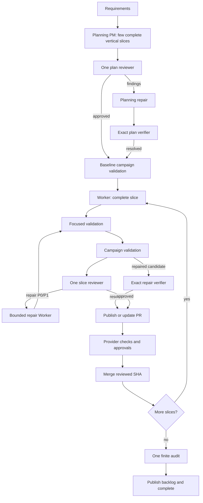
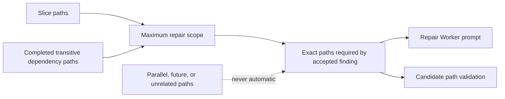
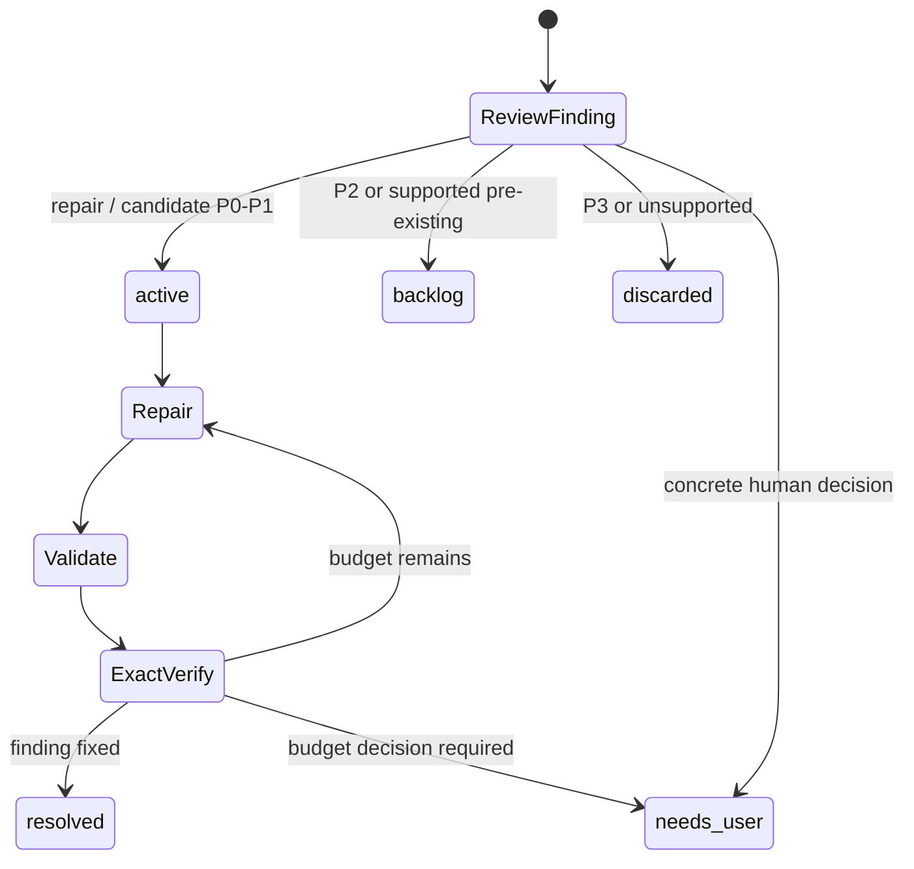
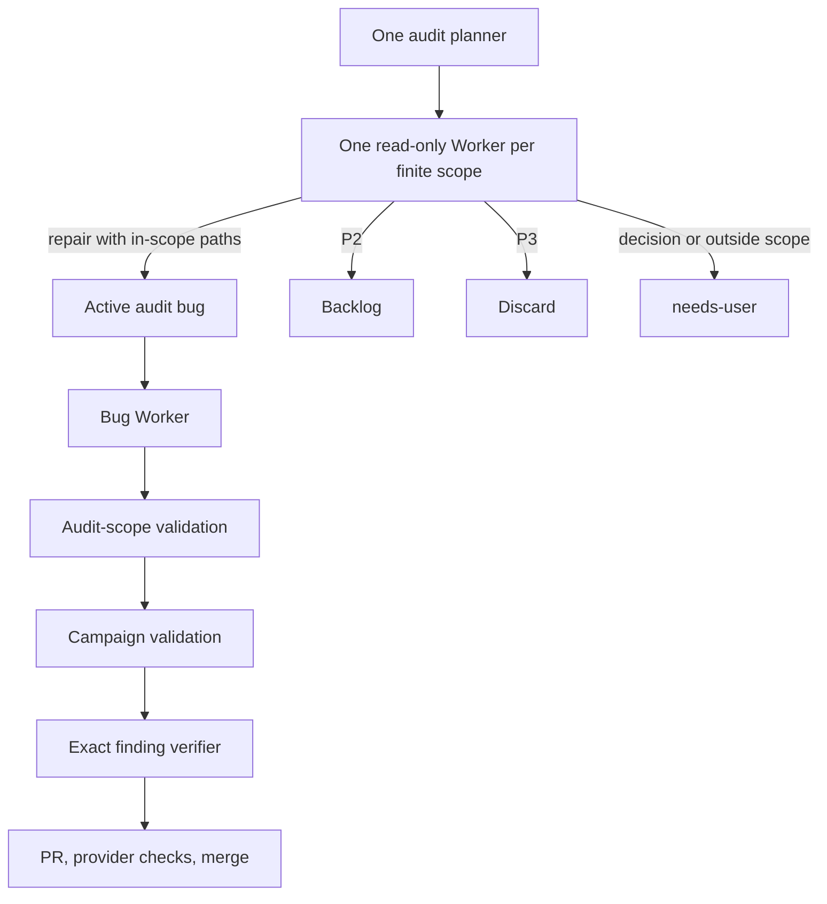

# Relay Architecture

Relay coordinates a bounded campaign of complete vertical slices. Only `run.py` writes active campaign state and ledgers; agents return structured evidence and Workers commit within an assigned worktree.

## End-to-end workflow



Review happens after both validation levels and before a new PR is published. An existing schema-2 PR is retained and updated after migration. The provider head must equal the final reviewed SHA before merge.

## Scope and ownership



Each slice owns its production entrypoint, direct collaborators, contracts, and tests. Dependencies express runtime prerequisites. Literal files, literal directories, segment wildcards, and `**` use one normalized path policy across scheduling, validation, recovery, review repair, audit, deleted files, and backlog tests.

Tests may fake external processes, networks, clocks, and providers. They do not replace an internal production component whose integration the slice is meant to prove.

## Inline bug lifecycle



Active, backlog, and needs-user findings are journaled to `bugs.md` before state advances. Discarded findings remain in the review session. Duplicate source assignment and finding IDs update the existing bug. Backlog entries retain a deferral reason; needs-user entries retain a decision reason.

## Final audit



Audit Workers provide dispositions directly; there is no triage call. Audit fixes do not receive a new full slice review and never create another audit plan.

## Persistence and recovery

Review sessions move forward through:

```text
slice-review -> approved | scope-resolution | repair-1 | needs-user
scope-resolution -> repair-N | needs-user
repair-N -> verify-N | repair-(N+1) | needs-user
verify-N -> approved | repair-(N+1) | needs-user
approved -> provider processing
```

The session persists the initial candidate, validated review result, accepted bug IDs, exact repair paths, counters, previous/current/pending SHAs, repair number, and final reviewed SHA. Call reservations and ledger intents are saved before external processes or ledger replacement, so a restart replays the same durable candidate or journal rather than granting a free attempt.

## Schema-2 migration

`run.py --recover` recognizes schema 2 before normal unsupported-schema rejection. Preview is read-only. Confirmation validates worktree, candidate, PR head, and ledger ownership; journals the migration; maps saved structured results to one slice review result; preserves counters, validation and audit evidence, provider deadlines, branches, worktrees, PRs, and SHAs; writes schema 3; and exits without launching an agent.

Approved and integrated sessions map directly. Untouched review maps to `slice-review`; numbered repair and verification phases keep their number; an out-of-scope finding maps to `scope-resolution`. Candidate-introduced P0/P1 findings become repair bugs, P2 and supported pre-existing findings become backlog, and P3 is discarded. Raw agent logs are never migration input. The next ordinary invocation resumes the persisted phase.
